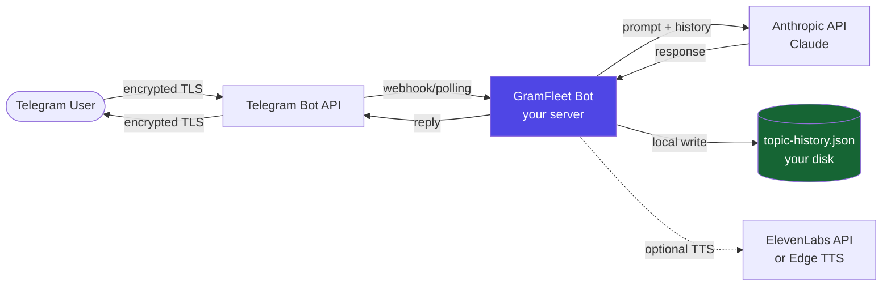

# GramFleet Security & Privacy

> Last updated: 2026-05

GramFleet is self-hosted infrastructure. Every component runs on your own server under your control. We do not operate a SaaS backend; there is no GramFleet cloud that your data passes through.

---

## Data Flow

### What leaves your server

| Service | What is sent | Why | Can be disabled |
|---------|-------------|-----|-----------------|
| **Telegram Bot API** | Message text, bot replies | Core routing | No (required) |
| **Anthropic API** | Conversation history (bounded by retention window) + system prompt | LLM inference | Replace with local model |
| **ElevenLabs API** | Bot reply text for TTS synthesis | Voice replies | Yes — use Edge TTS or disable voice |
| **Microsoft Edge TTS** | Bot reply text | Voice replies (free default) | Yes — disable voice globally |

Nothing else is sent anywhere. There are no analytics pings, no telemetry, no usage reporting.

---

## Where Data Is Stored

All persistent state lives on your server under `~/.claude/PAI/PULSE/`:

| File | Contents | Sensitive? |
|------|----------|-----------|
| `data/topic-history.json` | Per-topic conversation history | ✅ Yes |
| `data/topic-bindings.json` | Topic → folder mappings | Moderate |
| `data/topic-memory/<topic>.md` | Extracted long-term memory per topic | ✅ Yes |
| `state/state.json` | Settings, voice usage counters, tier info | Low |
| `state/pulse.pid` | Process ID | No |
| `logs/` | Operational logs (no message content) | Low |

Conversation history is stored as plain JSON. Protect the `~/.claude/PAI/PULSE/data/` directory appropriately.

---

## Retention Policy

- **Default:** 90 days. Messages older than 90 days are automatically deleted by a daily sweep.
- **Configurable per topic:** `/retention <days>` inside any bound forum topic.
- **Disable per topic:** `/retention 0` to keep history indefinitely.
- **Change global default:** `/retention global <days>`.
- **Manual delete:** `/clear` inside a project, or `TopicStore.clearHistory(topicName)` programmatically.

The daily sweep runs at startup and every 24 hours. Pruned messages and their compacted summaries are permanently deleted from disk.

---

## No Training Data Commitment

**GramFleet does not use your conversations to train AI models.**

- GramFleet is open-source software you run on your own server. We have no access to your data.
- Conversations sent to the **Anthropic API** are subject to [Anthropic's usage policies](https://www.anthropic.com/legal/privacy). Anthropic explicitly states that API data is not used for model training by default. You can review their [data privacy FAQ](https://www.anthropic.com/legal/privacy) for current terms.
- If you use **ElevenLabs** for TTS, their data processing terms apply to text sent for synthesis.
- If you use **Edge TTS** (default), audio synthesis runs locally via Microsoft's edge-tts service — review Microsoft's terms for speech data.

To minimize data exposure: keep retention short, use per-topic retention for sensitive topics, and review which Anthropic features (prompt caching, etc.) you enable.

---

## Encryption

- All communication with Telegram, Anthropic, and ElevenLabs uses TLS 1.2+.
- Data at rest (topic-history.json) is **not encrypted by default**. Encrypt the disk partition or use filesystem-level encryption if required.
- The bot token and API keys are read from environment variables or `~/.claude/.env`. Protect this file (chmod 600).

---

## Authentication & Access Control

- The bot responds only to messages from the **authorized Telegram chat** (supergroup). Messages from outside the registered group are ignored.
- There is no web login panel; the only control interface is the Telegram bot itself.
- Tier-based feature gates are enforced in-process. No external authorization service.

---

## Vulnerability Disclosure

To report a security issue: open a GitHub issue with the `security` label, or email the maintainer directly.

We aim to acknowledge reports within 48 hours and release patches within 7 days for critical issues.

---

## GDPR Compliance

GramFleet is infrastructure software operated by you (the controller) for your own users. When deployed for a team or organization:

- You act as **data controller** under GDPR Article 4(7).
- GramFleet (the software) acts as a **data processor** — it processes data on your behalf.
- Anthropic, ElevenLabs, and Telegram are **sub-processors**. Ensure you have appropriate DPAs in place with them.
- A **Data Processing Agreement** template covering GramFleet's role is available at [docs/DPA.md](./DPA.md).

Data subject rights (access, erasure, portability) can be fulfilled by:
- **Erasure:** `/clear` command or delete the relevant rows in `topic-history.json`.
- **Access/portability:** Export `topic-history.json` — it is plain JSON, human-readable and machine-parseable.
- **Restriction:** Set `/retention 0` to stop automated deletion, then manually review before any purge.
